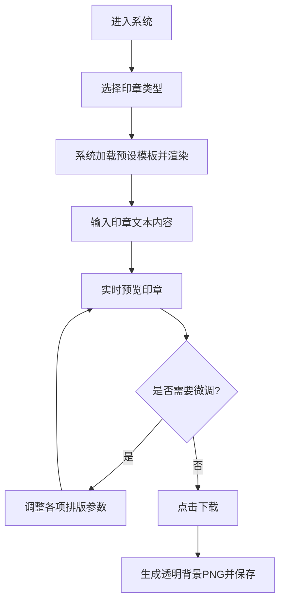

## 1. 产品概述
本项目是一款基于前端技术的在线电子印章生成工具，严格参考《北京市地方标准 DB11/T 918—2020 印章制作技术规范》设计。
主要解决用户快速生成合规、标准、带透明背景的电子印章需求。
核心价值在于提供高保真的印章排版能力、支持多种印章类型，并提供直观的手动微调和一键下载功能。

## 2. 核心功能

### 2.1 角色定义
本项目为纯前端单机工具，无复杂用户角色区分。
| 角色 | 注册方式 | 核心权限 |
|------|----------|----------|
| 访客 | 无需注册 | 浏览页面，生成印章，调整参数，下载印章图片 |

### 2.2 功能模块
1. **印章预览区**：实时渲染生成的印章，展示透明背景效果。
2. **印章配置区**：选择印章类型，输入印章文本（主文字、副文字、编码等）。
3. **参数微调区**：手动调整印章尺寸、边框宽度、文字大小、字距、五角星/徽标大小及位置等。
4. **操作区**：保存下载（PNG格式，透明背景）。

### 2.3 页面详情
| 页面名称 | 模块名称 | 功能描述 |
|----------|----------|----------|
| 首页 | 实时预览模块 | 使用 Canvas 或 SVG 实时绘制印章，展示透明背景（使用棋盘格背景示意）。 |
| 首页 | 类型选择模块 | 提供公章、合同章、财务专用章、发票专用章等预设模板。 |
| 首页 | 文本输入模块 | 输入机构名称、下排文字（如“合同专用章”）、防伪编码等。 |
| 首页 | 细节微调模块 | 提供滑块（Slider）调整字体大小、文字环绕角度、徽标垂直偏移、边框粗细等。 |
| 首页 | 下载导出模块 | 将当前渲染的印章转换为 PNG 图片并触发浏览器下载。 |

## 3. 核心流程
用户进入应用后，首先选择所需的印章类型。系统根据所选类型加载默认参数并渲染印章。用户随后修改文本内容，系统实时更新预览。若有排版偏差，用户可通过微调面板进行调整。最终点击下载，获取透明背景的 PNG 图片。

## 4. 用户界面设计
### 4.1 设计风格
- **主色调**：采用专业、严谨的政务/办公风格，主色为深蓝色（#1e3a8a）或中性灰，印章渲染颜色为标准印泥红（#e60000）。
- **按钮样式**：圆角微立体设计（Tailwind 默认 shadow-sm，hover 加深），主操作按钮醒目。
- **字体与大小**：界面字体使用无衬线字体（如 Inter, 系统默认字体），印章内严格使用规范要求的字体（宋体、仿宋、Arial 等）。
- **布局风格**：左右分栏布局（左侧配置区，右侧预览及下载区）或上下响应式布局。
- **图标建议**：使用简洁的线框图标表示设置、下载、刷新等。

### 4.2 页面设计概览
| 页面名称 | 模块名称 | UI 元素 |
|----------|----------|---------|
| 首页 | 预览区 | 居中大画布，透明棋盘格背景，红色印章图案，带阴影的卡片容器。 |
| 首页 | 配置区 | 分组的表单面板（基础设置、高级微调），包含下拉框、文本输入框、滑动条（Slider）、折叠面板。 |
| 首页 | 底部操作区 | 突出的“下载 PNG”按钮，支持一键重置参数按钮。 |

### 4.3 响应式设计
优先适配桌面端（Desktop-first），考虑到复杂的参数调整，桌面端采用左右分栏结构以提供最佳体验；移动端采用上下堆叠布局，上方预览固定（或支持滚动），下方为参数配置区。
