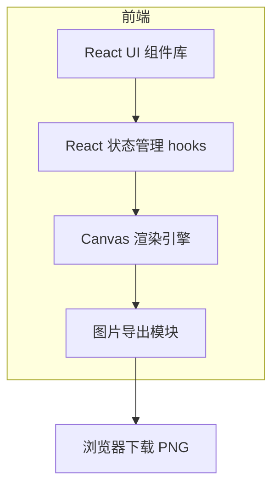

## 1. 架构设计

本项目为一个纯前端 Web 应用程序，无需后端服务。所有印章渲染逻辑在客户端执行。主要架构包括：



## 2. 技术栈说明
- **前端框架**：React@18
- **构建工具**：Vite
- **样式方案**：Tailwind CSS v3 (通过 postcss)
- **UI 组件库**：lucide-react (图标), 自定义基础表单组件（或简单的 Headless UI）
- **核心渲染库**：纯原生 HTML5 `<canvas>` API 进行环形文字排版、五角星绘制、椭圆/圆形绘制，不依赖第三方 Canvas 库以减小体积和提高定制性。

## 3. 路由定义
作为单页应用，本项目无需复杂路由。
| 路由 | 用途 |
|------|------|
| `/` | 首页：包含所有印章生成和调整功能 |

## 4. 核心数据模型与状态 (State)
前端状态主要维护当前印章的配置参数。

```typescript
// 印章配置参数类型定义
interface SealConfig {
  type: 'public' | 'contract' | 'finance' | 'invoice'; // 印章类型
  shape: 'circle' | 'ellipse'; // 形状
  width: number; // 宽/直径
  height: number; // 高/直径
  borderWidth: number; // 边框宽度
  color: string; // 印章颜色 (如 #e60000)

  // 主文字 (上方环排)
  mainText: string;
  mainTextSize: number;
  mainTextMargin: number; // 距离边缘的距离
  mainTextAngle: number; // 环排角度(夹角)

  // 徽标/五角星
  hasStar: boolean;
  starSize: number;
  starOffsetY: number;

  // 下方横排文字 (如“合同专用章”)
  subText: string;
  subTextSize: number;
  subTextOffsetY: number;

  // 底部编码 (如“1101010000001”)
  codeText: string;
  codeTextSize: number;
  codeTextMargin: number; // 距离底部的距离
}
```

## 5. 核心渲染逻辑
Canvas 渲染核心流程如下：
1. **清理画布**：`clearRect`。
2. **绘制边框**：根据 `shape` 为 `circle` 或 `ellipse` 绘制路径，并进行 `stroke`。
3. **绘制中心徽标**：计算五角星各顶点坐标（支持 `starOffsetY` 垂直偏移），填充红色。
4. **绘制上方环排文字**：
   - 使用 `context.save()` 和 `context.restore()`。
   - 移动坐标系到中心点。
   - 根据给定的 `mainTextAngle` 计算每个字符对应的旋转角度。
   - 对每个字符调用 `fillText`。
5. **绘制下方横排文字**：在中心点下方绘制 `subText`，调整 `subTextOffsetY`。
6. **绘制底部编码**：根据 `codeTextAngle` 环排或水平排版编码。

## 6. 导出与下载
利用 Canvas 原生方法 `canvas.toDataURL('image/png')` 导出 Base64 数据，通过创建临时 `<a>` 标签设置 `href` 并触发 `click` 事件实现本地下载。
